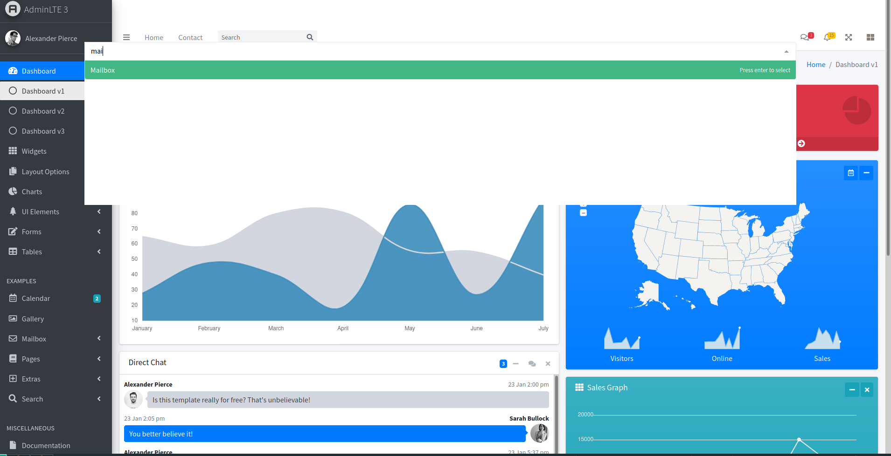

# fastVenu

## About
Simple project for making navigation searchable. Created in mind with legacy project using old template and a lot of jQuery.
After pressing keyboard shortcut user gets fullscreen VueMultiselect instance feeded with content of navigation provided object at init. Then user can happy search through all records and press "enter" to move to new location.

## Lazy implementation for AdminLTE 3
Addding this code at the bottom of the document
```html
<link rel="stylesheet" href="https://unpkg.com/vue-multiselect@2.1.0/dist/vue-multiselect.min.css">
<script src="dist/fastVenu.css">
<script src="dist/fastVenu.umd.min.js">
<script>
  document.addEventListener( "DOMContentLoaded",
  (function(){  
    window.fastVenuInstance.setUpOnElement(document.querySelector('nav.mt-2 > ul.nav'),'li.nav-item > a.nav-link','p');
  }), false);
</script>
```
will produce this (after pressing ```CTRL + ALT + K``` by default)




## Project setup
```
yarn install
```

### Compiles and hot-reloads for development
```
yarn serve
```

### Compiles and minifies for production
```
yarn build
```

### Run your unit tests
```
yarn test:unit
```

### Lints and fixes files
```
yarn lint
```

### Customize configuration
See [Configuration Reference](https://cli.vuejs.org/config/).
